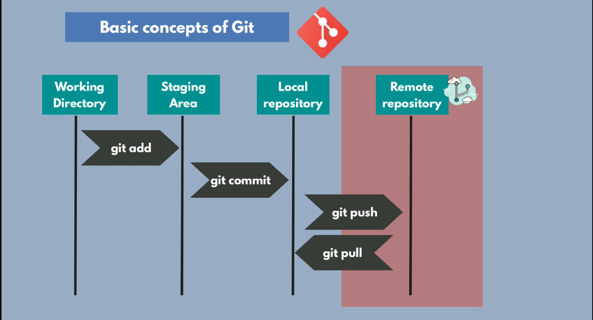

Git is a powerful version control system used by developers to track changes in their codebases, collaborate with others, and manage their projects. Git client is used to execute git commands.



**Basic Git Commands:**

1. **`git init`** : Initializes a new Git repository. This command creates a new `.git` directory in the project directory, which contains all the necessary metadata for the repo.
2. **`git clone [url]`** : Makes a copy of an existing repository. This command is used to download a repository from an existing URL.
3. **`git add [file]`** : Adds files to the staging area. It's used to include the changes of the files in the next commit. Use `git add .` to add all changed files in the directory.
4. **`git commit -m "[commit message]"`** : Saves changes to the repository. This command takes the staged changes and commits them with a descriptive message explaining what was changed.
5. **`git status`** : Shows the status of changes as untracked, modified, or staged.
6. **`git push [remote] [branch]`** : Uploads local branch commits to the remote repository branch. `remote` is typically `origin`, and `branch` is the branch you want to push.
7. **`git pull [remote] [branch]`** : Fetches changes from the remote repository and merges them into the local branch.
8. **`git branch`** : Lists all the local branches in the repository. With `-a`, it shows all branches (local and remote).
9. **`git branch [branch name]`** : Creates a new branch.
10. **`git checkout [branch name]`** : Switches to a specified branch and updates the working directory.
11. **`git checkout -b [branch name]`**: Creates and switches to a specified branch and updates the working directory.
12. **`git push --set-upstream origin [branch name]`**: Pushes the locally created branch to the remote repository.
13. **`git branch -d [branch name]`**: Delete a branch after deleting it from remote repository.
14. **`git merge [branch]`** : Merges the specified branch into the current branch.
15. **`git rebase [branch]`** : Applies changes from one branch onto another. It's an alternative to merge but rewrites commit history to produce a linear progression of changes.
16. **`git pull -r`** : The `-r` stands for rebase. If the current working branch has some commits on the remote by other developers, rebase will not create a new commit that merges the local and remote changes. Instead, it will stack our local commits on top of the remote commits.
17. **`git diff`** : Shows the differences between files in the working directory and the index or between two commits.
18. **`git reset [file]`** : Removes files from the staging area. `git reset --hard [commit]` resets the current branch to the specified commit, discarding all changes.
19. **`git log`** : Displays the commit history for the current branch. Use `--oneline`, `--graph`, `--decorate` for simplified or detailed views.
20. **`git fetch [remote]`** : Downloads objects and refs from another repository.
21. **`git rm [file]`** : Removes files from the working directory and the index.
22. **`git stash`** : Temporarily shelves changes so you can work on a different task. Use `git stash apply` to reapply the stashed changes.
23. **`git tag [tag name]`** : Marks a specific point in history as important. Typically used for marking release points (v1.0, etc.).
24. **`git remote add [remote name] [remote url]`** : Adds a new remote Git repository as a shortname.

These commands represent the fundamentals that most Git users will need on a regular basis.

**Git commands for reverting a mistake:**

Reverting mistakes in Git involves using a set of commands designed to undo changes, restore previous states, or alter the commit history in a controlled manner. Here are some Git commands that are particularly useful for handling mistakes:

1. **`git checkout [file]`** : Discards changes in the working directory. This command reverts the file back to the last committed state.
2. **`git revert [commit]`** : Creates a new commit that undoes the changes made in a specified commit. This is a safe way to undo changes without rewriting commit history.
3. **`git reset --soft [commit]`** : Moves the current branch's tip backward to the specified commit, but leaves the working directory and the staging area as they were. This is useful for undoing commits while retaining the changes for reworking.
4. **`git reset --mixed [commit]`** (default): Moves the current branch's tip backward to the specified commit and resets the staging area to match, but leaves the working directory unchanged. Changes are preserved but unstaged.
5. **`git reset --hard [commit]`** : Resets the current branch's tip to the specified commit, and resets both the staging area and the working directory to match. This command discards all changes since the specified commit, which can be dangerous if not used carefully.
6. **`git push --force`** : Forcefully pushes the current branch to the remote repository, overwriting the remote branch with local changes. This is used if the local and remote histories have diverged, such as after a reset or rebase, and should be used with caution to avoid overwriting others' work.
7. **`git reflog`** : Shows a log of where the tips of branches and other references were in the recent past. This can be used to find commits that were lost due to a hard reset or other actions that rewrite history.
8. **`git checkout [commit] [file]`** : Restores a file to the state it was in at a specific commit. Useful for reverting individual files to a previous state without affecting the entire project.
9. **`git clean -df`** : Removes untracked files and directories from the working directory. This can help clean up after a merge conflict or when unwanted files have been added to the directory.
10. **`git stash push -m "[message]"`** : Temporarily shelves changes so you can switch contexts. If you made a mistake and need to work on something else, you can stash your changes and come back to them later.
11. **`git stash pop`** : Applies changes from the most recently stashed state and removes it from the stash stack. This can be used to reapply changes that were stashed to revert to a clean working directory.
12. **`git commit --amend`** : Modifies the most recently made commit. This is useful for correcting mistakes in your last commit, such as a typo in the commit message or forgetting to include a file.
13. **`git reset HEAD [file]`** : Unstages a file while retaining the changes in the working directory. Useful for undoing a `git add [file]` before a commit.

Remember, commands like `git reset --hard` and `git clean -df` can lead to data loss if used carelessly. Always make sure you understand the implications of a command before executing it, especially when rewriting history or altering tracked files.

**Adding `.gitignore` file:**

The `.gitignore` file is a crucial component in a Git repository, used to tell Git which files or directories to ignore in the project. It helps in preventing unnecessary files from being tracked or uploaded to the repository. Here are some important commands and steps related to setting up and managing a `.gitignore` file:

1. **Creating a `.gitignore` file**: You can create a `.gitignore` file in your repository's root directory or in any subdirectory to apply ignore rules locally.

    ```
    touch .gitignore
    ```

2. **Editing `.gitignore`**: Open the `.gitignore` file in a text editor and add patterns for the files and directories you want to ignore.

    Example:

    ```
    # Ignoring all .log files
    *.log

    # Ignoring a specific directory
    node_modules/

    # Ignoring a specific file
    config.env
    ```

3. **Checking the status**: Use `git status` to see if there are any untracked files that you might want to ignore. If you see files that should be ignored, update your `.gitignore` accordingly.

    ```
    git status
    ```

4. **Adding `.gitignore` to the repository**: After setting up your `.gitignore`, you need to add it to your repository and commit it. This is an important step because it ensures that the ignore rules are shared with anyone else working on the project.

    ```
    git add .gitignore
    git commit -m "Add .gitignore file"
    ```

5. **Force-remove files that were already tracked**: If you added rules to `.gitignore` for files that were previously tracked by Git, these files will continue to be tracked. To stop tracking them, you need to remove them from the index (cache) and commit this change.

    ```
    git rm --cached [file]
    ```

    For removing directories or multiple files matching a pattern, use the recursive option:

    ```
    git rm -r --cached [directory]
    ```

    After removing the cached files, commit the changes:

    ```
    git commit -m "Remove ignored files"
    ```

6. **Checking if a file is ignored**: To check if a file is ignored by your `.gitignore` rules, you can use `git check-ignore`.

    ```
    git check-ignore [file]
    ```

Remember, `.gitignore` rules apply only to untracked files. Files that are already tracked by Git will continue to be tracked even after you add them to `.gitignore`. To stop tracking a file that is currently tracked, you must explicitly remove it from the index as shown above.

**Different pattern formats for specifying files and directories should be ignored:**

The `.gitignore` file in Git supports various pattern formats for specifying which files and directories should be ignored. Understanding these patterns can help you effectively manage the files in your repository. Here's a breakdown of the different pattern styles you can use in a `.gitignore` file:

1. **Wildcards**:

    - `*` matches zero or more characters in a filename (but not a directory separator).
        - Example: `*.log` ignores all files with the `.log` extension.
    - `?` matches exactly one character.
        - Example: `?.txt` ignores all files with names that are exactly one character long, followed by `.txt`.

2. **Directory patterns**:

    - To ignore a directory and all its contents, include the directory's name followed by a slash (`/`).
        - Example: `node_modules/` ignores the `node_modules` directory and all its contents.

3. **Specific file paths**:

    - To ignore specific files or directories, provide the relative path from the repository's root.
        - Example: `config/database.yml` ignores a specific file named `database.yml` inside the `config` directory.

4. **Excluding files**:

    - Precede a pattern with an exclamation mark (`!`) to negate the pattern and include the specified files.
        - Example: `!README.md` will track `README.md` even if previously defined patterns match it.

5. **Comments**:

    - Lines starting with `#` are treated as comments and ignored.
        - Example: `# This is a comment`.

6. **Directory patterns without a trailing slash**:

    - Including a directory name without a trailing slash (`/`) allows you to match files or directories with that name.
        - Example: `doc` matches a file called `doc` or a directory named `doc`.

7. **Double asterisks (`**`):\*\*

    - `**` matches any number of directories. You can use it in the middle of a path.
        - Example: `**/logs` matches all directories named `logs` at any level within the repository.
    - `**` at the end of a pattern can specify all files inside a directory, across directories.
        - Example: `assets/**` ignores all files within the `assets` directory, at any depth.

8. **Slash (`/`) at the start of a pattern**:

    - A leading slash indicates that the pattern is relative to the root of the `.gitignore` file's directory.
        - Example: `/temp` ignores the `temp` directory at the root but not `src/temp`.

These patterns can be combined and layered to create a comprehensive `.gitignore` file that accurately represents the files and directories you want Git to ignore. Tailoring your `.gitignore` file to your project's specific needs can help keep your repository clean and free of unnecessary files.
